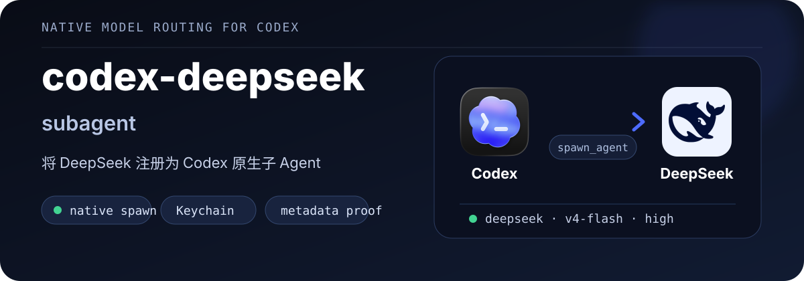
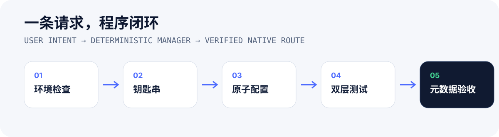

<p align="center">
  
</p>

<p align="center">
  <strong>用户只说目标，Agent 调用程序完成配置、验证与回滚。</strong>
</p>

<p align="center">
  <a href="#安装">安装</a> ·
  <a href="#使用">使用</a> ·
  <a href="#它做了什么">工作原理</a> ·
  <a href="#安全边界">安全边界</a>
</p>

## 它是什么

`codex-deepseek-subagent` 是一个面向 Codex 的自动配置 Skill。它把 `deepseek-v4-flash` 注册成原生自定义子 Agent，并通过真实子任务会话元数据确认最终路由。

它不会把操作步骤交给用户，也不会让 Agent 临时手改配置。所有确定性工作由一个 Python 管理程序完成。

<p align="center">
  
</p>

## 安装

```bash
npx skills add oil-oil/codex-deepseek-subagent -g -y
```

当前支持：

- macOS
- Python 3.11+
- Codex CLI 或 ChatGPT 桌面应用已经至少启动一次
- DeepSeek 官方 API Key

## 使用

安装后直接告诉 Agent：

```text
帮我把 DeepSeek 配置成 Codex 的原生子 Agent。
```

如果本机还没有 DeepSeek 凭据，Agent 会在聊天中索要 API Key，然后通过标准输入交给管理程序。用户不需要执行命令或编辑配置。

配置完成后的普通任务直接使用原生 DeepSeek 子 Agent：

```text
用 DeepSeek 子 Agent 检查这个模块的错误处理。
```

这个 Skill 只在首次配置、检查、修复、停用或卸载时触发。配置验收成功后，DeepSeek 已作为 Codex 原生 `DeepSeek` 角色持久存在；日常任务由主 Agent 直接调用，不会重复运行配置流程。

## 它做了什么

管理程序一次完成：

1. 检查 Codex 版本、配置和当前模型目录。
2. 把 API Key 写入 macOS Keychain。
3. 从 DeepSeek 官方安装脚本读取模型元数据，但不执行远程脚本。
4. 合并模型目录，保留原有 OpenAI 模型。
5. 注册 `deepseek` Provider 和 `DeepSeek` 自定义 Agent。
6. 运行 DeepSeek 直连测试。
7. 运行原生 `spawn_agent(agent_type="DeepSeek")` 测试。
8. 从 Codex 会话数据库确认实际 Provider、模型、思考程度和角色。

成功验收必须同时满足：

```text
model_provider = deepseek
model = deepseek-v4-flash
reasoning_effort = high
agent_role = DeepSeek
```

## 程序化接口

Skill 内部使用：

```bash
python3 codex-deepseek-subagent/scripts/codex_deepseek.py status --json
python3 codex-deepseek-subagent/scripts/codex_deepseek.py setup --api-key-stdin --json
python3 codex-deepseek-subagent/scripts/codex_deepseek.py test --json
python3 codex-deepseek-subagent/scripts/codex_deepseek.py repair --json
python3 codex-deepseek-subagent/scripts/codex_deepseek.py disable --json
python3 codex-deepseek-subagent/scripts/codex_deepseek.py uninstall --json
```

这些是给 Agent 使用的内部接口，不是要求用户手动执行的安装步骤。

## 安全边界

- API Key 不写入 `config.toml`、模型目录、临时文件或测试结果。
- Key 通过标准输入进入管理程序，并保存到 macOS Keychain。
- 写入前创建备份，配置和模型目录通过解析验证后才原子替换。
- 实时测试失败时回滚本次事务。
- 不修改 Codex 主任务的顶层模型或登录方式。
- DeepSeek V4 Flash 当前是纯文本模型；图片、视频和截图由父 Agent 识别后转成文字任务包。
- 已存在但不兼容的用户配置不会被静默覆盖。

## 品牌素材

README 使用真实品牌素材：

- Codex 图标取自本机官方 ChatGPT 应用资源。
- DeepSeek 图标取自 DeepSeek 官方 CDN。

相关商标与品牌素材归各自权利人所有，本项目与 OpenAI 或 DeepSeek 无隶属或官方背书关系。

## 开发与验证

```bash
python3 scripts/test_manager.py
python3 scripts/build_readme_assets.py
```

## License

[MIT](./LICENSE)
